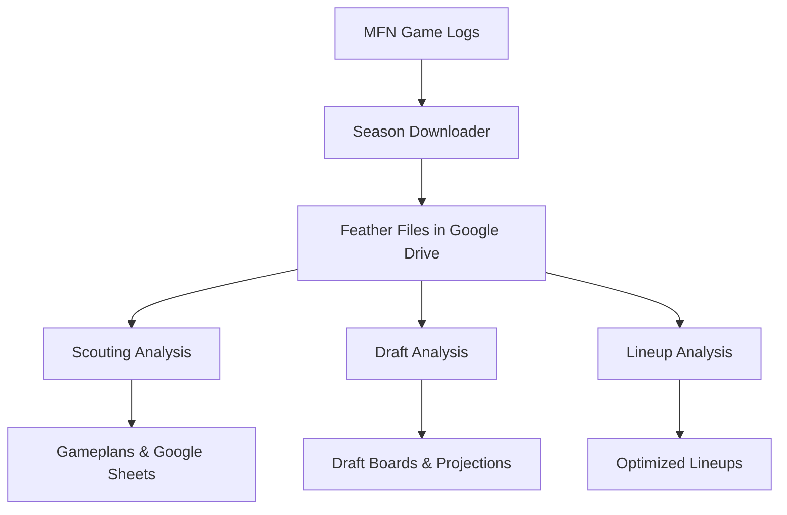

# MFN Analytics Suite

A comprehensive set of tools for analyzing MyFootballNow (MFN) league data, including draft analysis, lineup optimization, and opponent scouting.

## 📁 Directory Structure

### 🏈 [`scouting/`](./scouting/)
**Advanced opponent analysis and gameplan generation**

The scouting directory contains tools for analyzing opponent tendencies and generating defensive/offensive gameplans. This is the core analytics engine for competitive play.

**Key Features:**
- **Gameplan Generator**: Automated analysis of opponent tendencies by formation with counter-play recommendations
- **Best Offense/Defense Analysis**: Statistical analysis of most effective plays across all historical data
- **Season Data Management**: Tools for downloading and processing game log data
- **Google Sheets Integration**: Export gameplans and analysis directly to spreadsheets

**Main Tools:**
- `gameplan_generator/` - Automated gameplan creation with personnel-specific recommendations
- `season_download/` - Download and process MFN season data
- `best_offense.py` / `best_defense.py` - Statistical play effectiveness analysis
- `main.py` - Core data processing and expected value calculations

**Data Storage:** Uses Google Drive (`~/Google Drive/My Drive/James Docs/MFN/Feathers/`) for cross-computer data access.

---

### 🎯 [`draft_analyzer/`](./draft_analyzer/)
**Draft strategy and player projection system**

Advanced analytics for draft preparation, including boom/bust projections and position-specific analysis.

**Key Features:**
- **Boom/Bust Analysis**: Predict player ceiling and floor based on historical patterns
- **Multi-Position Analysis**: Evaluate players who can play multiple positions
- **Draft Board Generation**: Create prioritized draft boards with value calculations
- **Live Draft Tracking**: Real-time draft analysis and recommendations

**Main Components:**
- `core/` - Primary analysis engine with projection models
- `boom_analysis/` - Player volatility and upside prediction
- `archive/` - Legacy tools and experimental features

**Use Cases:** Pre-draft preparation, live draft assistance, player evaluation

---

### 👥 [`lineup_analyzer/`](./lineup_analyzer/)
**Lineup optimization and free agent analysis**

Tools for optimizing starting lineups and evaluating free agent opportunities.

**Key Features:**
- **Lineup Optimization**: Find the best starting lineup based on player ratings
- **Position Flexibility**: Handle players who can play multiple positions
- **Free Agent Analysis**: Identify valuable free agents and improvement opportunities
- **Google Sheets Integration**: Export lineups and analysis to spreadsheets

**Main Tools:**
- `lineup_analyzer.py` - Core lineup optimization engine
- `free_agent_analyzer.py` - Free agent market analysis
- Position movement rules and restrictions

**Use Cases:** Weekly lineup decisions, roster management, free agent targeting

---

### 🗃️ [`other_scripts/`](./other_scripts/)
**Legacy and utility scripts**

Collection of older scripts and utilities that may be cleaned up or integrated in the future.

---

## 🚀 Getting Started

### Prerequisites
- Python 3.8+
- Google Drive Desktop (for data storage)
- MFN league access for data downloads

### Quick Setup
1. **Clone the repository**
   ```bash
   git clone https://github.com/jamesjones291986/MFN.git
   cd MFN
   ```

2. **Set up each module** (each directory has its own requirements.txt):
   ```bash
   # Install scouting dependencies
   cd scouting && pip install -r requirements.txt
   
   # Install lineup analyzer dependencies  
   cd ../lineup_analyzer && pip install -r requirements.txt
   
   # Install draft analyzer dependencies
   cd ../draft_analyzer && pip install -r requirements.txt
   ```

3. **Configure Google Drive**: Ensure Google Drive Desktop is installed and synced to access feather data files.

### Usage Examples

**Generate a gameplan:**
```bash
cd scouting/gameplan_generator/src
python automated_gameplan_generator.py --league USFL --season 2018 --team SJS
```

**Analyze your lineup:**
```bash
cd lineup_analyzer
python lineup_analyzer.py
```

**Run draft analysis:**
```bash
cd draft_analyzer/core
python multi_position_boom_analyzer.py
```

## 📊 Data Flow



## 🛠️ Technical Details

- **Data Storage**: Large data files (.feather) stored in Google Drive for cloud access
- **Cross-Platform**: Flexible path detection works across different computers
- **Google Sheets**: Integrated export capabilities for sharing analysis
- **Modular Design**: Each directory is self-contained with its own dependencies

## 🤝 Contributing

Each module has its own README with specific development guidelines. See individual directories for detailed documentation.

## 📝 License

This project is for personal use in analyzing MyFootballNow leagues.